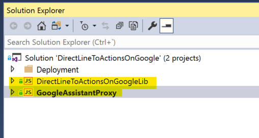
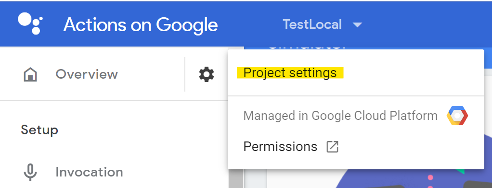
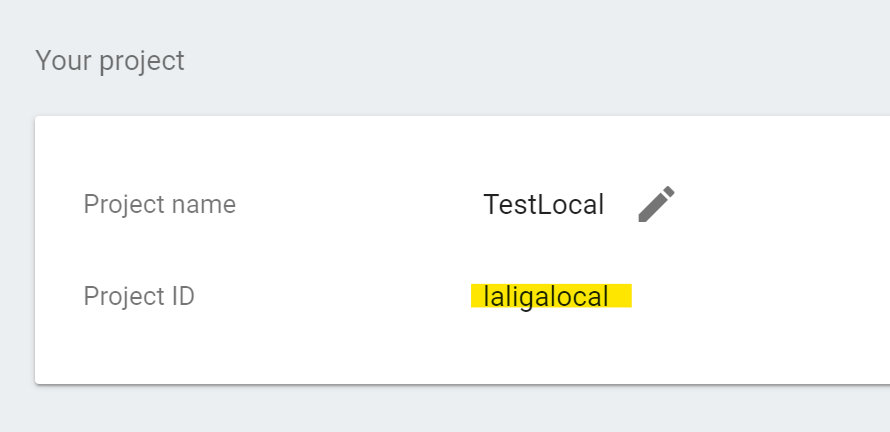

# Google Assistant Proxy
> [here for English document](README.md)

Instalando y configurando este servicio proxy, podemos interaccionar con nuestro *Bot Framework* desde *Google Assistant*.

Para ello, tenemos que crearnos un projecto en *Action on Google* que apunte a nuestro servicio proxy. Este a su vez, se comunicará con muestro bot mediante [*Direct Line*](https://docs.microsoft.com/en-us/azure/bot-service/bot-service-channel-connect-directline?view=azure-bot-service-4.0). 

> Nota: Si no estás familiarizado con *Actions on Google*, te recomiendo que pruebes estos [laboratorios](https://developers.google.com/actions/codelabs/).

## Guía rápida
### 1. Descarga el código y compila la solución.



> Si no te abre correctamente los proyectos, quiere decir que no tienes instalado el componente *desarrollo de Node.js* 
>
>.

### 2. Publica el proyecto *GoogleAssitantProxy*.

> También puedes probar el proyecto en local utilizando ***ngrok***. Te enseño cómo [aqui](googleAssistantProxy.deploy.local.es.md).
>
> Una vez que hayas probado la solucción, te recomiendo que la integres dentro de tu proyecto y lo despliegues todo junto utilizando *DevOps*.

### 3. Configura settings

- Añade el settings **DIRECT_LINE_SECRET**
 con el *key secret* del canal *Direct Line* de tu bot.
 - Asegurate que la versión de Node sea al menos la 7.10.1 (en Azure mediante el *setting* **WEBSITE_NODE_DEFAULT_VERSION**)

> Te enseño como [aqui](Azure.settings.es.md)

### 4. Configura las plantillas *actions.json*
   
Actualiza las **plantillas de *GoogleAction*** con la url de tu *GoogleAssitantProxy*. (una plantilla para cada idioma que soporte nuestro bot).

>En la carpeta *Deployment* hay a modo de ejemplo dos plantillas (una para inglés y otra para español).
   ```json
   {
    "locale": "es",
    "actions": [{
        "description": "<descripción>",
        "name": "MAIN",
        "fulfillment": {
            "conversationName": "MAIN_CONVERSATION"
        },
        "intent": {
            "name": "actions.intent.MAIN",
          "trigger": {
            "queryPatterns": [ "Hablar con <nombre de tu bot>", "Hola <nombre de tu bot>", "Quiero hablar con <nombre de tu bot>"]
            }
        }
    }],
    "conversations": {
      "MAIN_CONVERSATION": {
        "name": "MAIN_CONVERSATION",
        "url": "<url-de-tu-despliegue-GoogleAssitantProxy>",
        "inDialogIntents": [
          {
            "name": "actions.intent.CANCEL"
          }
        ],
        "fulfillmentApiVersion": 2
      }
    }
}
   ```
   
 ### 5. Actualiza tu proyecto *Actions for Google*

- Actualiza en el script ***GoogleActionDeploy.cmd*** el identificador de tu proyecto *Actions for Google*
   ```
   gactions update --project PROJECTID --action_package action.es.json --action_package action.en.json
   ```
- Ejecuta el script ***GoogleActionsDeploy*** (si es la primera vez que lo haces, requiere que se autentiques con tu cuenta Google).

  > Este script hace uso de ***gactions CLI***, que es la herramienta de línea de comandos para actualizar los proyectos de *Actions on Google*. Más información [aquí](https://developers.google.com/actions/tools/gactions-cli).
  >  
  > Para obtener el identificador del proyecto. En la consola de [*Actions on Google*](https://console.actions.google.com) de tu proyecto, *Settings* (la tuerca), *Project ID*.
  >  

 ### 6. Prueba si funciona
 Prueba en el simulador de la [consola](https://console.actions.google.com) de 'Actions for Google' y comprueba si responde.

> Puedes ver la ***consola en Azure*** en *Advanced Tools*, *Log streaming*
>
>  


 ### 7. Configura *GoogleAssitantProxy*
 Ahora que tenemos toda la infraestructura configurada, vamos a configurar nuestro proxy para que se adapte mejor a nuestro bot.

 - Mensajes de bienvenida, etc. [aqui](googleAssistantProxy.messages.es.md)
 - Otros posibles settings. [aqui](googleAssistantProxy.settings.es.md)

 ## Agradecimientos
 Muchas gracias a *Capgemini* por el impresionante trabajo que realizaron [aquí](https://github.com/Capgemini-AIE/bot-framework-actions-on-google). Este código está inspirado en su trabajo.

 A [@juliapiedrahita](https://twitter.com/juliapiedrahita) por empezar este proyecto y dejarme el trabajo facil.


